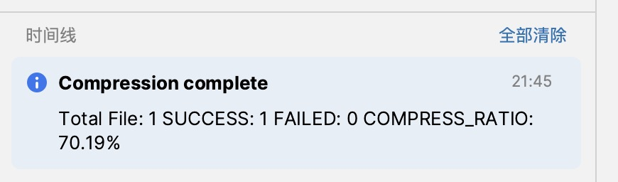
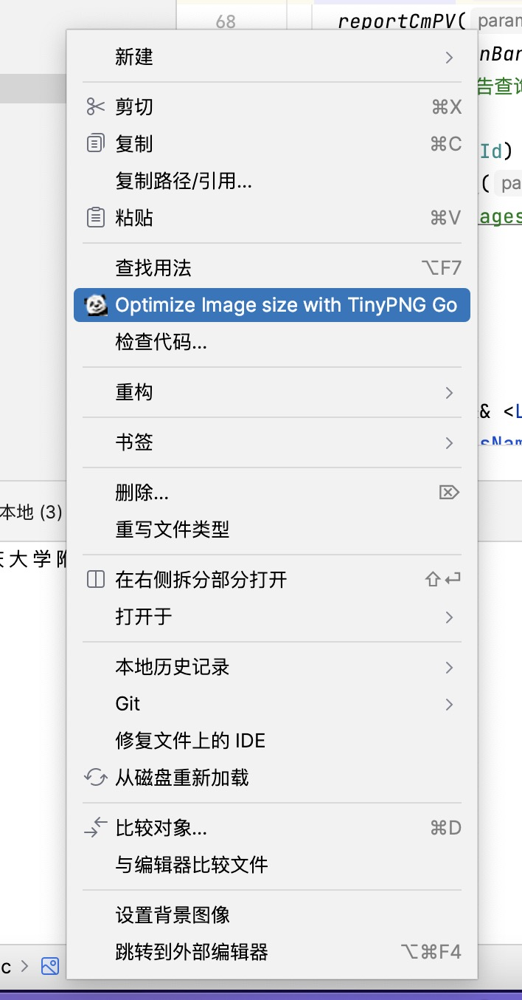

<!-- Plugin description -->

# tinypng-go

IDEA compressed image plug-in, based on tinypng-go, without key, you can compress infinitely by right-clicking.

## Installation

[Plugin Home](https://plugins.jetbrains.com/plugin/19693-tinypng-go)

## Usage

---
If you have any questions, please give [feedback on GitHub][GitHub].

[GitHub]: https://github.com/mushan0x0/tinypng-go-plugin-idea

<!-- Plugin description end -->
